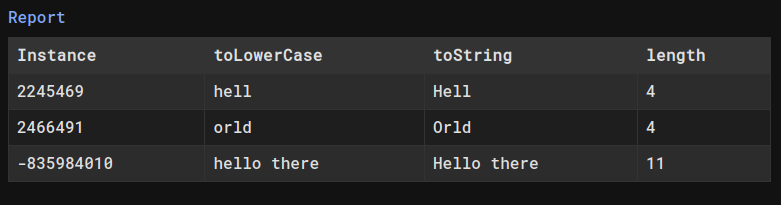

# Elaborate
Visualize your Java classes.

Instead of printing results to the console, use Elaborate to generate an HTML file with the results. 
This is useful when you have a large number of instances and methods to analyze, 
providing a better overview of the results.

It offers a more convenient alternative to printing to the console or using a debugger. 
With the added benefit of creating a permanent record of the analysis.

Elaborate requires Java 11 or higher.



## Installation
For now, only local installations are supported. In the future, I'm hoping to publish it to Maven Central.

You have two options to use Elaborate in your project:
[Using a jar file](#using-a-jar-file) or [Publishing to Maven Local](#publishing-to-maven-local).

### Publishing to Maven Local
By publishing the jar file to Maven Local, you can use it as a dependency in your projects.

```shell
git clone git@github.com:MituuZ/elaborate.git
cd elaborate
./gradlew publishToMavenLocal
```

#### Adding a local/remote dependency
This requires adding the local Maven repository to your project's repositories.
```kotlin
repositories {
    mavenLocal()
}
```

```kotlin
dependencies {
    implementation("com.mituuz:elaborate:<version>")
}
```

### Using a jar file
You can alternatively use the jar file directly in your project.

```shell
git clone git@github.com:MituuZ/elaborate.git
cd elaborate
./gradlew jar
```

#### Adding a jar file dependency
For gradle, just add the jar file to your project's dependencies, and you're good to go.

```kotlin
dependencies {
    implementation(files("path/to/elaborate.jar"))
}
```

## Usage
### Create a new Elaborate instance with the class that you want to analyze
```java
Elaborate<CustomClass> elaborate = new Elaborate<>();
```

### Set Elaborate parameters
Configure your Elaborate instance to output the desired information

Filtering can be done using conditional methods.

```java
Elaborate<String> elaborate = new Elaborate<>();
elaborate.generateHtml(); // Generate an HTML file
elaborate.generateHtmlTable(); // Generate an HTML table file
elaborate.addInstances(List.of("Hello", "Orld")); // Add the class instances to analyze
elaborate.addAnalyzeMethods("toString", "toLowerCase", "length"); // Add the methods to analyze
```

### Run the analysis
```java
elaborate.analyze(); // Analyze the class
```

### Output
This setup will provide the following output:

Prints to the console:
```
toString: Hello
toLowerCase: hello
length: 5

toString: Orld
toLowerCase: orld
length: 4
```

Generates the following files:
- `results.html`
- `table.html`
- `styles.css`

## ToDo
- [ ] Create a csv file
- [ ] Separate conditionals to separate classes for better constructors
  - Add conditionals through a builder method
- [ ] Allow renaming title method in HTML table
- [ ] Create a builder class
- [ ] Add sorting
- [ ] Publish to Maven Central
- [ ] Allow specifying the output file path and name
- [ ] Add support for fields instead of only methods
  - i.e. check for the default methods based on the field name
  - Record or getter methods
- [ ] Add support for known methods
  - e.g. `size`, `isBlank`
- [ ] Generate unique names for files
- [ ] Add support for custom css
  - Try to load it after inlining the default css
- [ ] Add field configurations (stylize results based on values)
- [x] Check that the css is copied correctly when using the jar file
- [x] Generate a css file
- [x] Add some styling to the HTML output
- [x] Add filtering
- [x] Allow disabling stdout printing
- [x] Use classes instead of strings to collect the data
- [x] Add title configuration (which field/method to use as the element title)
- [x] Change boolean parameters to sets with default values and no parameters

## License
This project is licensed under the MIT License - see the [LICENSE](LICENSE) file for details.
